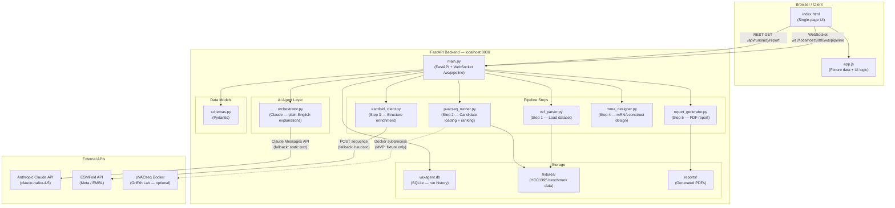
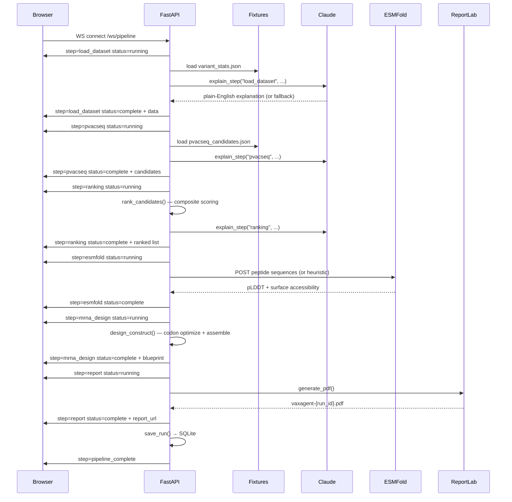
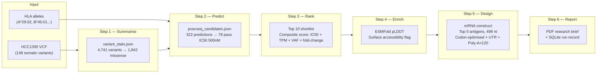

# VaxAgent System Architecture

**Date:** April 2026
**Project:** HSIL Hackathon 2026 MVP
**Type:** Explainable Oncology Research Workflow Copilot

---

## System Diagram


---

## Overview

VaxAgent has two independently runnable layers:

- **Layer A — Pure Frontend** (`index.html` / `app.js` / `styles.css`): a fully self-contained demo with no backend dependency. Demo-ready today.
- **Layer B — Full Backend Pipeline** (`backend/`): a FastAPI service that streams a real 6-step bioinformatics pipeline over WebSocket, with Claude-powered explanations, PDF report generation, and SQLite run history.

---

## High-Level Architecture



---

## Pipeline Flow (WebSocket)

Each step emits a real-time message to the browser:
`{ "step": "...", "status": "running|complete|error", "explanation": "...", "data": {}, "run_id": "..." }`



---

## File Structure

```
MVP/
├── index.html                    ← Layer A: one-page demo UI
├── styles.css                    ← Warm-tone design system
├── app.js                        ← BX-17 fixture data + all UI logic
│
├── backend/                      ← Layer B: FastAPI pipeline
│   ├── main.py                   ← App entrypoint + WebSocket + REST routes
│   ├── requirements.txt
│   ├── .env.example
│   │
│   ├── agent/
│   │   └── orchestrator.py       ← Claude API + 6-step static fallbacks
│   │
│   ├── pipeline/
│   │   ├── vcf_parser.py         ← VCF parsing (fixture-first)
│   │   ├── pvacseq_runner.py     ← Candidate loading + composite ranking
│   │   ├── esmfold_client.py     ← ESMFold API + heuristic fallback
│   │   ├── mrna_designer.py      ← Codon optimisation + UTR + Poly-A
│   │   └── report_generator.py  ← ReportLab PDF generation
│   │
│   ├── models/
│   │   └── schemas.py            ← Pydantic models for all data types
│   │
│   ├── db/
│   │   └── database.py           ← Async SQLite via aiosqlite
│   │
│   ├── fixtures/
│   │   ├── variant_stats.json    ← HCC1395 mutation summary
│   │   └── pvacseq_candidates.json ← 10 precomputed neoantigen candidates
│   │
│   └── reports/                  ← Generated PDF reports (git-ignored)
│
└── docs/
    ├── architecture.md           ← This file
    ├── mini-prd.md
    ├── demo-script.md
    ├── acceptance-criteria.md
    └── out-of-scope.md
```

---

## Data Flow



---

## Candidate Ranking Algorithm

Priority score (0–100) computed in `pvacseq_runner.py`:

```
binding_score    = max(0, 50 × (1 − IC50_mt / 500))   # weight: 50 pts
expression_score = min(30, TPM / 2)                    # weight: 30 pts
clonality_score  = VAF × 15                            # weight: 15 pts
specificity_score = min(5, fold_change / 10)           # weight:  5 pts

priority_score = binding_score + expression_score + clonality_score + specificity_score
```

**Current top-5 from HCC1395 fixture:**

| # | Gene | Mutation | IC50 (nM) | TPM | VAF | Score |
|---|------|----------|-----------|-----|-----|-------|
| 1 | TP53 | R248W | 45.2 | 38.2 | 48% | 76 |
| 2 | PIK3CA | E545K | 78.6 | 31.5 | 42% | 69 |
| 3 | BRCA1 | T1685I | 124.3 | 18.7 | 39% | 56 |
| 4 | PTEN | R130Q | 198.4 | 22.4 | 35% | 48 |
| 5 | RB1 | R698W | 267.1 | 15.2 | 31% | 36 |

---

## mRNA Construct Architecture

```
5' Cap (m7GpppN)
│
├── 5' UTR  (human α-globin derived, 38 nt)
│
├── Signal peptide  (MHC-II Ii chain — METPAQLLFLLLLWLPDTTG, 60 nt)
│
├── Antigen cassette (codon-optimised, separated by GPGPG linkers)
│   ├── TP53 R248W  epitope
│   ├── [GPGPG linker]
│   ├── PIK3CA E545K epitope
│   ├── [GPGPG linker]
│   ├── BRCA1 T1685I epitope
│   ├── [GPGPG linker]
│   ├── PTEN R130Q  epitope
│   ├── [GPGPG linker]
│   └── RB1 R698W   epitope
│
├── Stop codon (TGA)
│
├── 3' UTR  (human β-globin derived, 75 nt)
│
└── Poly(A) tail  (×120 A residues)

Total: 498 nt (preview sequence — not a validated therapeutic design)
```

---

## API Reference

### REST

| Method | Path | Description |
|--------|------|-------------|
| GET | `/health` | Liveness check |
| GET | `/api/runs` | List past runs (last 20) |
| GET | `/api/runs/{run_id}` | Get full run data |
| GET | `/api/runs/{run_id}/report` | Download PDF (Content-Type: application/pdf) |

### WebSocket

| Path | Query param | Description |
|------|-------------|-------------|
| `/ws/pipeline` | `dataset_id=hcc1395` | Run full pipeline, streaming step updates |

---

## Dependency Map

| Package | Version | Role |
|---------|---------|------|
| `fastapi` | ≥0.110 | HTTP + WebSocket framework |
| `uvicorn[standard]` | ≥0.29 | ASGI server |
| `anthropic` | ≥0.26 | Claude API client |
| `httpx` | ≥0.27 | Async HTTP (ESMFold) |
| `pydantic` | ≥2.7 | Data validation |
| `reportlab` | ≥4.2 | PDF generation |
| `aiosqlite` | ≥0.20 | Async SQLite |
| `python-dotenv` | ≥1.0 | `.env` loading |

---

## Fallback Strategy

Every external dependency has a hardcoded fallback so the demo path is never blocked:

| Dependency | Live mode | Fallback |
|------------|-----------|----------|
| pVACseq Docker | Subprocess + TSV parse | `fixtures/pvacseq_candidates.json` |
| VCF parsing | Parse `.vcf` / `.vcf.gz` | `fixtures/variant_stats.json` |
| Claude API | `claude-haiku-4-5` | 6 pre-written explanations |
| ESMFold API | POST to public endpoint | Sequence-composition heuristic |
| PDF report | `reportlab` | — (reportlab is a hard dependency) |

> **Demo principle:** if a feature threatens the stable happy path, it must be stubbed, simplified, or removed. (Source: `docs/acceptance-criteria.md`)

---

## Limitations (Required Disclosure)

- Single synthetic benchmark dataset only (HCC1395).
- Candidate ranking is fixture-based — not a live neoantigen pipeline.
- Less than 5% of computationally predicted neoantigens trigger a clinical immune response.
- Draft mRNA construct is for research discussion only — not optimised for manufacturing.
- No clinical recommendation or treatment guidance is implied.
- Human expert review is required before any downstream scientific use.
